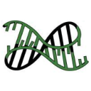

#  MD_analysis_oligomers

**Analysis of molecular dynamics (MD) simulations of RNA oligomers**

This repository provides data and analysis tools for studying the structural dynamics of RNA oligomers, specifically:

- **distances between nucleobases**, computed via their **C5 carbon atoms** (within the base rings)
- **Hydrogen bonds** between bases, detected throughout the MD trajectories

The project includes preprocessed structural data and a ready-to-run analysis notebook.  

---

## 📁 Repository structure

```
MD_analysis_oligomers/
├── DATA_structures/
│ ├── molname_distances_i.npy # C5–C5 distances for subtrajectory i of oligomer 'molname'
│ ├── molname_Hbonds_i.npy # Hydrogen bonds for subtrajectory i
│ ├── reference_test_molname.pdb # Reference PDB structure of each oligomer
│ └── n_frames.pickle # Number of frames per subtrajectory
│
├── my_notebooks/
│ ├── importdata.ipynb # Preprocesses raw MD output from remote university storage and uploads to Zenodo
│ ├── importdata_structure.ipynb # Preprocesses raw MD output from remote university storage and uploads to DATA_structures
│ └── MD_analysis_complete.ipynb # Full-featured exploratory notebook (not standalone)
│
├── MD_analysis.ipynb # Standalone analysis notebook using data from DATA_structures and Zenodo
└── README.md # This file
```

## 🧪 Project overview

This project supports structural analysis of RNA oligomers based on MD simulations.  
Key observables include:

- **C5–C5 distances**: Used to quantify base–base spatial relationships
- **Hydrogen bonds**: Computed using geometric criteria between donor/acceptor atoms

These quantities have been computed from raw MD data on remote university storage as described in [`importdata_structure.ipynb`](my_notebooks/importdata_structure.ipynb)

---

## ⚡ Quick start: minimal analysis (from DATA_structures)

To explore the results with data only from DATA_structures (inter-residue distances and hydrogen bonds):

  - Run the analysis: [`MD_analysis.ipynb`](MD_analysis.ipynb)

     Self-contained analysis using data in [`DATA_structures`](DATA_structures/) and [`Zenodo`](https://zenodo.org/records/14956459)

> ✅ Does **not require raw MD outputs**  
> ✅ Recommended for most users

---

##  Full workflow

- [`importdata.ipynb`](my_notebooks/importdata.ipynb):  
  Used to extract raw MD output from a **remote university network storage** and upload the data to Zenodo. Not runnable without access to that network.

- [`importdata_structure.ipynb`](my_notebooks/importdata_structure.ipynb):  
  Used to extract raw MD output from a **remote university network storage**, compute C5 distances and Hydrogen bond files from raw trajectories, and upload these data to [`DATA_structures`](DATA_structures/). Not runnable without access to that network.

- [`MD_analysis_complete.ipynb`](my_notebooks/MD_analysis_complete.ipynb):  
  A detailed, exploratory version of the analysis.

---

## 📄 Data description: `DATA_structures/`

This directory contains all you need for structural analysis in [`MD_analysis.ipynb`](MD_analysis.ipynb):

- `molname_distances_i.npy`  
  → Numpy array of pairwise **C5–C5 distances** between nucleobases for subtrajectory `i` of oligomer `molname`

- `molname_Hbonds_i.npy`  
  → Numpy array of hydrogen bonds between nucleobases over time for the same subtrajectory

- `reference_test_molname.pdb`  
  → Reference PDB structure for each RNA oligomer

- `n_frames.pickle`  
  → Dictionary of frame counts per trajectory segment

---

Further data (beyond inter-residue distances and hydrogen bonds) are publicly available on [`Zenodo`](https://zenodo.org/records/14956459). They have been obtained from raw data as indicated in [`MDRefine`](https://github.com/bussilab/MDRefine/blob/master/Examples/load_data_oligomers.ipynb).

## 📦 Dependencies

The main notebook [`MD_analysis.ipynb`](MD_analysis.ipynb) requires the following Python libraries:

```
os
pandas
pickle
numpy
matplotlib
sklearn
MDAnalysis
```

You can install them via:

`pip install pandas numpy matplotlib scikit-learn MDAnalysis`

The second part of the notebook [`MD_analysis.ipynb`](MD_analysis.ipynb) requires also the following Python libraries:

```
sys
jax
MDRefine
```

You can install them via:

`pip install sys jax MDRefine`

## 📚 Scientific context

This project enables systematic analysis of RNA conformational behavior from MD simulations.  
The data provide insights into:

- **base pairing and stacking** through C5–C5 distances  
- **stability and dynamics** of inter-base hydrogen bonds

If you use this dataset or code in your research, please cite the references

- Gilardoni, I., Piomponi, V., Fröhlking, T., & Bussi, G. (2025).  
  **MDRefine: A Python package for refining molecular dynamics trajectories with experimental data**.  
  *The Journal of Chemical Physics*, 162(19). AIP Publishing.  
  [https://doi.org/10.1063/5.0256841](https://doi.org/10.1063/5.0256841)

- Gilardoni, I., Fröhlking, T., & Bussi, G. (2024).  
  **Boosting ensemble refinement with transferable force-field corrections: Synergistic optimization for molecular simulations**.  
  *The Journal of Physical Chemistry Letters*, 15(5), 1204–1210. ACS Publications.  
  [https://doi.org/10.1021/acs.jpclett.3c03423](https://doi.org/10.1021/acs.jpclett.3c03423)

- Fröhlking, T., Bernetti, M., & Bussi, G. (2023).  
  **Simultaneous refinement of molecular dynamics ensembles and forward models using experimental data**.  
  *The Journal of Chemical Physics*, 158(21). AIP Publishing.  
  [https://doi.org/10.1063/5.0151163](https://doi.org/10.1063/5.0151163)

---

## 🙋‍♀️ Questions or feedback?

Feel free to:

- 📂 [Open an issue](https://github.com/IvanGilardoni/MD_analysis_oligomers/issues)
- 📧 Contact the author: `igilardo@sissa.it`

